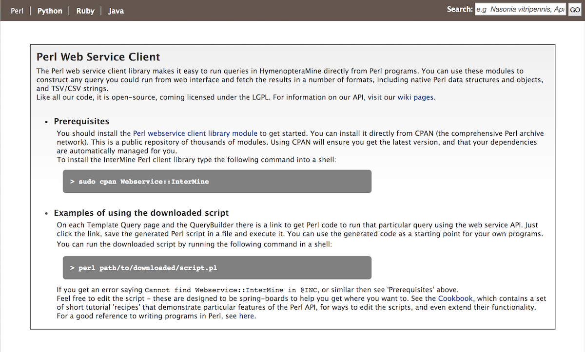

API
===

An API is available for users who would like to programmatically access HymenopteraMine.

  ..

  ..

Perl, Python, Ruby, and Java are the languages supported by the InterMine API.

For more detailed information, view the `InterMine documentation <https://intermine.readthedocs.io/en/latest/web-services>`_.
