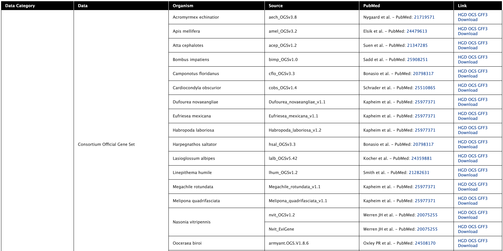

Data Sources
============

The Data Sources table provides a description of the datasets that are integrated into HymenopteraMine, along with their date of download, version or release, citations wherever applicable, and any additional comments.

  Data sources table

  ..

