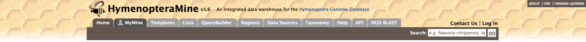

.. HymenopteraMine_v1.4 documentation master file, created by
   sphinx-quickstart on Thu Oct  3 12:00:01 2019.
   You can adapt this file completely to your liking, but it should at least
   contain the root `toctree` directive.

HymenopteraMine v1.4 Documentation
==================================

HymenopteraMine is an integrative resource for genomic data on Hymenoptera, including honeybees, ants, wasps, etc. Powered by `InterMine <http://intermine.org>`_, it provides a user-friendly way to access genomic, proteomic, interaction and literature data. HymenopteraMine is a part of the `Hymenoptera Genome Database <http://www.hymenopteragenome.org>`_.

This tutorial is aimed at giving users an introduction to the different parts of HymenopteraMine and how users can make the most of HymenopteraMine.

Main site: http://hymenopteragenome.org/hymenopteramine

HGD YouTube Channel with HymenopteraMine Videos: https://www.youtube.com/channel/UC1NVFd9buEtlbA2mcdq0MXQ

List of available datasets in HymenopteraMine: http://hymenopteragenome.org/hymenopteramine/dataCategories.do

.. toctree::
   :caption: Table of Contents
   :maxdepth: 4
   :hidden:
   
   overview
   searching
   reports
   lists
   mymine
   api
   data_sources
   blast
   how_to_cite
