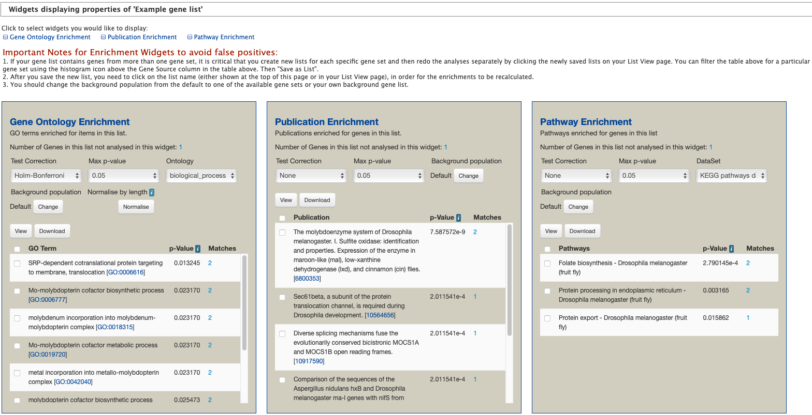

.. _lists:

Lists
=====

Creating Lists
~~~~~~~~~~~~~~

Users may create and save lists of features, such as gene IDs, transcript IDs, gene symbols, etc. The list tool searches the database for the list items and attempts to convert each identifier to the selected type. Click on the **Lists** tab from the menu to access the full list upload form. A short version of the form is also in the **Quick List** box on the home page.

  List upload form

  ..

As an example, enter the following identifiers (comma-separated):
::

     GB41586, Sec61Beta, TRAM, Mocs1, mal

Leave the **Select Type** as "Gene" and **Organism** drop-down as "Any". Then click **Create List**. A Summary table is displayed with the results of searching for each of the five identifiers in the list.

  Example: Search results for list of five identifiers

  ..

Next, click **Save a list of 5 Genes**. A **List Analysis** page is presented that contains widgets allowing users to perform analyses on the genes in the list.

  Example: List analysis for gene list

  ..

The available widgets are:

1. Chromosome Distribution

2. Gene Ontology Enrichment

3. Protein Domain Enrichment

4. Publication Enrichment

5. Pathway Enrichment

6. Orthologues

The selection of widgets provided on the List Analysis page depend on the contents of the list. In the above example, three widgets appear: Gene Ontology Enrichment, Publication Enrichment, and Pathway Enrichment.

  Example: Available widgets

  ..

Saving Lists
~~~~~~~~~~~~

Saved lists appear under the **View** tab on the Lists page. For users who are not logged in, lists are saved temporarily; users must log in to save lists permanently. Saved lists may also be accessed from the **MyMine** menu item.

Predefined lists of all genes from different species are also available on the Lists page for all users.

  Saved lists. Lists belonging to user are highlighted.

  ..

