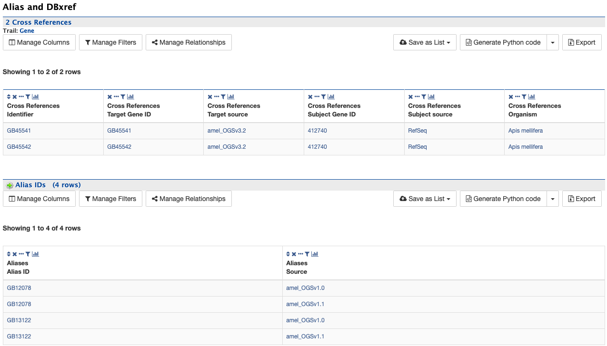
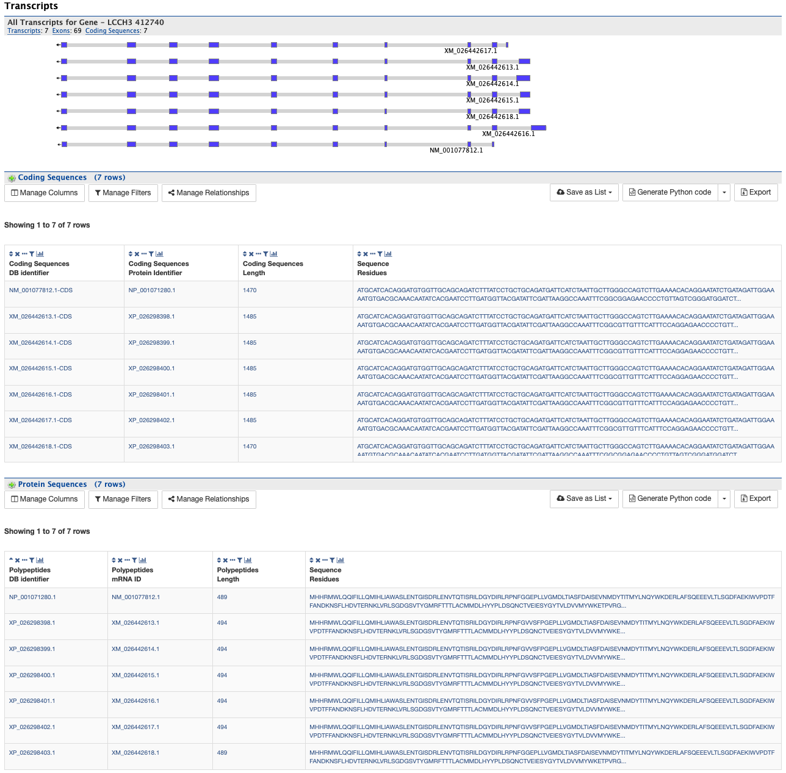
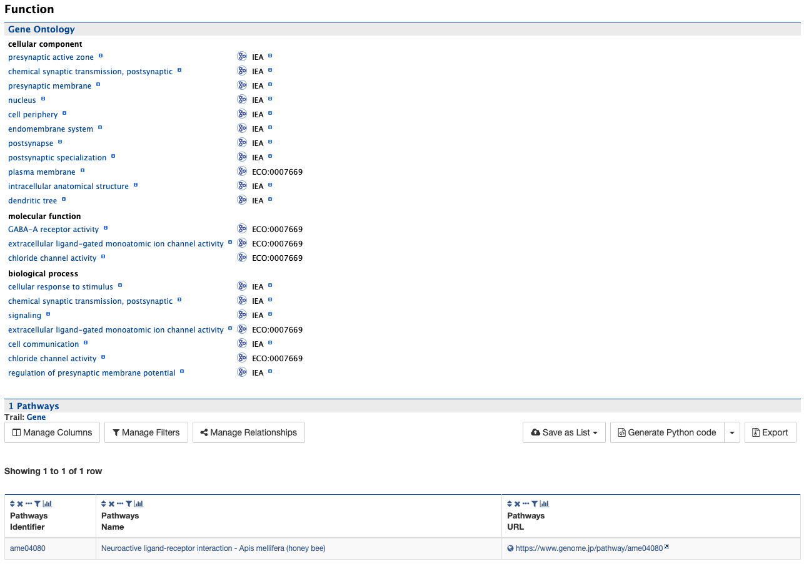

Report Pages
============

Every object (e.g., Gene, Protein, Exon) in HymenopteraMine has a report page. The layout of the report page depends on the data available for the object. Report pages may be accessed by clicking on an object name in the results table after running a query.

As an example, on the home page of HymenopteraMine, click on the **Protein** tab in the **Popular Templates** section. (Refer to the :ref:`templates` section for more details on using templates to search the database.) Click on the **Gene Symbol --> Proteins** template. In the text field, enter **LCCH3**, and select **A. mellifera** as the Organism. Then click **Show Results**.

Notice that each item in the results table is a hyperlink. Hover over an item to bring up a quick summary window for that item. For example, hover over **LCCH3** to view a summary of the gene with this symbol. The summary contains the gene's biotype, database identifier, description, length, organism, symbol, and source. Similarly, hover over **Q0GQR5_APIME** to view a summary of the protein with this DB Identifier.

  Example: Summary window for LCCH3

  ..

Clicking on an item in the table rather than just hovering over it will bring up its report page. For example, click on LCCH3 in the Gene Symbol column to view its report.

  Report page

  ..

The report page provides a complete description for this gene. The header displays the database identifier, followed by the information from the summary window for the gene (organism, symbol, source, etc.) **Biotype** indicates the type of gene; in this case the type is protein coding.

The contents of the report page are divided into categories based on the type of information provided.

Summary
~~~~~~~

A **Summary** section near the top of the report provides information on the gene such as its length, chromosome location, and strand information.

Alias and DBxref
~~~~~~~~~~~~~~~~

The **Alias and DBxref** section displays a table of aliases and database cross references for the gene. In this example, the gene with DB Identifier 412740 has four aliases and two cross references. Click on the text **4 Alias Names** and **2 x Refs** to expand the table with additional rows containing the ID and Source for each alias and DB Identifier and Source for each cross reference.

Transcript
~~~~~~~~~~

The **Transcript** section contains information about the gene model, such as transcripts, exons, etc. It includes a diagram visually representing each transcript with its features highlighted (if applicable). In the case of protein coding genes, a table with protein information is also provided.

Proteins
~~~~~~~~

The **Proteins** section provides information about the protein product of gene. The comments section gives a brief description about the protein along with the UniProt accession.

Function
~~~~~~~~

The **Function** section displays Gene Ontology annotations for a gene. Annotations are divided into three categories:

* Cellular Component

* Molecular function

* Biological process

The GO terms are displayed along with the evidence code indicating how the annotations were derived. If applicable, a table of information on Pathways is also shown.

Homology
~~~~~~~~

The **Homology** section includes information on homologues for the gene.

Publications
~~~~~~~~~~~~

The **Publications** section displays a table of publications related to the gene.

Other
~~~~~

This last section provides miscellaneous information that doesn't fit into any of the above categories, e.g., data sets including a gene, protein domain regions for a protein, etc.

