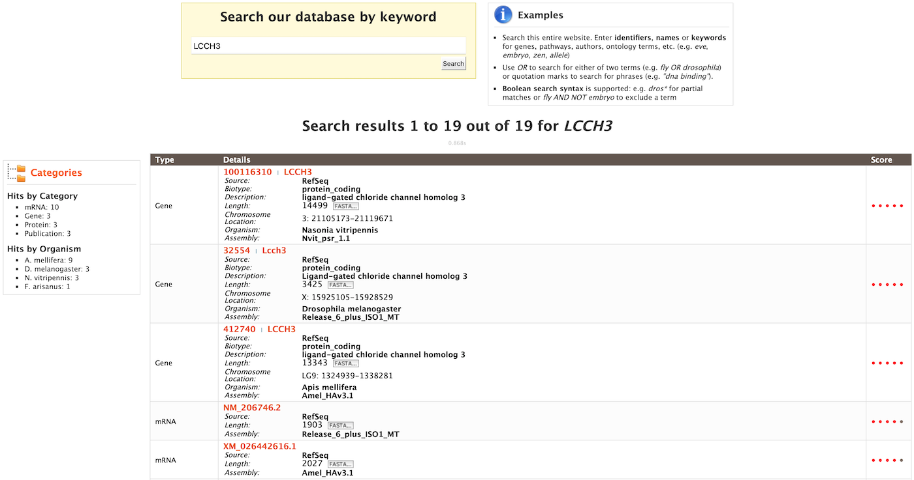
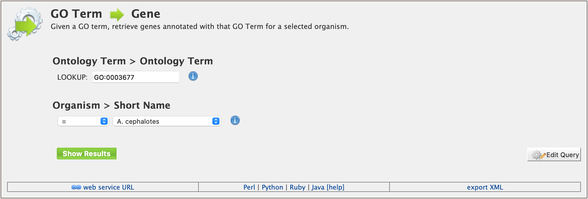
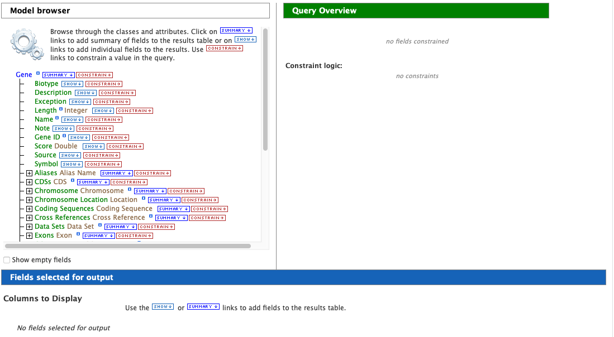
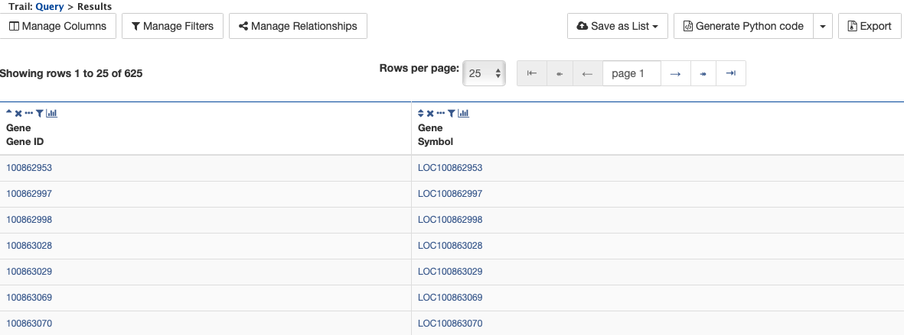
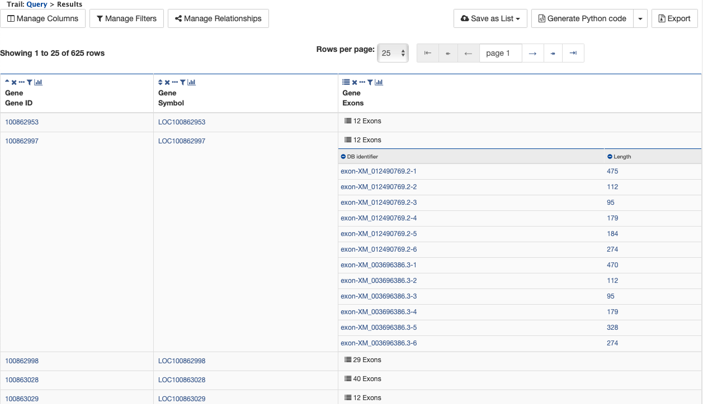
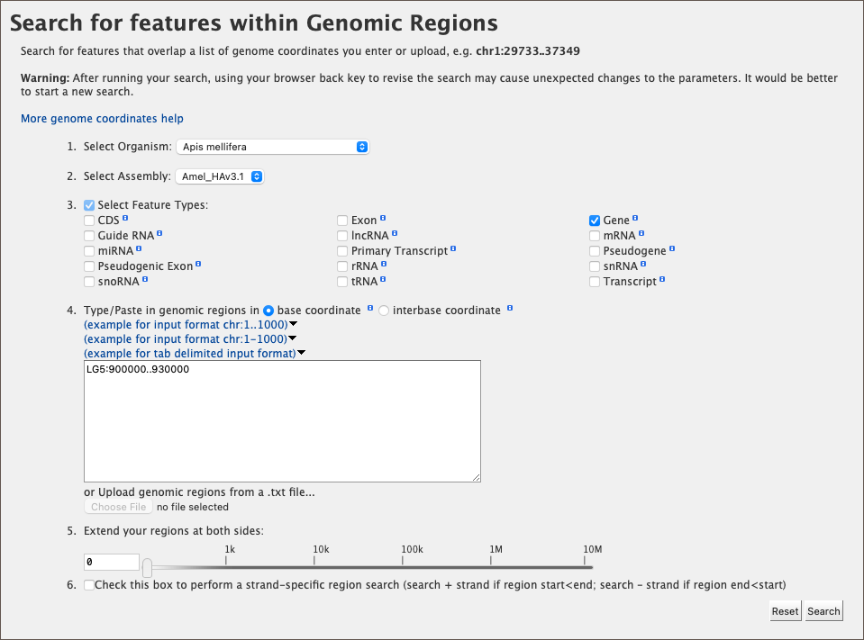

Searching in HymenopteraMine
============================

.. role:: raw-html(raw)
    :format: html

There are several ways that users may query HymenopteraMine.

Quick Search
~~~~~~~~~~~~

The **Quick Search** enables users to search keywords from any of the datasets on HymenopteraMine. The quick search box is located on the main page and in the upper-right corner of each page.

.. figure:: images/quick_search.png
  :width: 280
  :alt: Quick Search from home page
  :figclass: align-center

  Quick Search from home page

  ..

.. figure:: images/quick_search_menu.png
  :width: 280
  :alt: Quick Search on Gene
  :figclass: align-center

  Quick Search from any page

  ..

Users may enter gene names, gene identifiers, or keywords to search for within HymenopteraMine. The wildcard character `*` may be used to get all results matching the search query.

As an example, to search on the gene **LCCH3**, enter **LCCH3** into the quick search box and click **Search**. The results page displays a summary for the query in a tabular format.

  Example: Search results for LCCH3

  ..

The search results may be filtered by **Category** or **Organism**. The score column in the result table indicates the similarity of the query to the result fetched by HymenopteraMine.

The results page may also be converted to a list. To enable this feature, click on **Gene** in **Hits by Category**. Select the gene(s) to be included in the list, and click on the **Create List** button just above the table of search results. Lists are described in more detail in the :ref:`lists` section.

  Example: Search results restricted to Gene category

  ..

.. _templates:

Templates
~~~~~~~~~

Another method of searching HymenopteraMine is through the use of **templates** (predefined queries). Popular templates are displayed on the home page, grouped by category (Genes, Protein, Homology, etc.) The full list of templates may be viewed by clicking the **Templates** menu tab.

  Popular templates

  ..

  List of templates on the Templates page

  ..

As an example, the **GO Term --> Gene** template queries HymenopteraMine for all genes having a given GO term.

  Example: GO Term --> Gene template

  ..

The results page shows all the genes having the Gene Ontology term "DNA Binding" in their annotation. When logged in, users may create a new list or add these genes to an existing list to perform further analyses. Click on the **Save as List** button above the table of results, then choose the column to add to the list. See the :ref:`lists` section for more details on creating and saving lists.

  Example: Results after searching on `GO:0003677` (identifier for GO term "DNA binding")

  ..

Generate query code
-------------------

The code for each query may be obtained by clicking on the arrow next to **Generate Python Code** and choosing the desired language from the pull-down menu. The language options are Python, Perl, Java, Ruby, JavaScript, and XML.

  Generate code options

  ..

Download results
----------------

The search results may also be downloaded by clicking the **Export** button above the table and choosing the desired format from the pull-down menu to the right of the File name field (blue box in the figure below). Available formats are tab-separated values, comma-separated values, XML, and JSON. When the results contain genomic features, they may also be downloaded in FASTA, GFF3, or BED format. Other options may be specified in the submenu to the left of the download box (orange box in the figure below). By default, all rows and all columns are downloaded, but individual columns may be included or excluded by clicking on the toggles next to the column headers in the **All Columns** submenu. The number of rows and row offset are set in the **All Rows** submenu. Download the results as a compressed file by choosing GZIP or ZIP format in the **Compression** submenu (default is **No Compression**). Column headers are not added by default but may be included under the **Column Headers** submenu. Finally, the **Preview** submenu displays the first three rows of the file to be downloaded so that the desired format and options may be finalized before beginning the download. When ready, click the **Download file** button to download the results.

  Download results options

  ..

Customize output
----------------

Click the **Manage Columns** button to customize the results table layout. Edit or remove active filters by clicking the **Manage Filters** button. Click **Manage Relationships** to specify the entity relationships within the query.

Optional filters
----------------

Some templates have optional filters that are disabled by default. For example, the GO Term --> Gene template has an additional filter for specifying a GO evidence code. To enable this filter, click **ON** below **GO Evidence Code > Code**.

.. figure:: images/template_go_term_gene_ec_enabled.png
  :width: 696
  :alt: GO Term --> Gene template with GO evidence code filter enabled
  :figclass: align-center

  Example: GO Term --> Gene template with GO evidence code filter enabled

  ..

QueryBuilder
~~~~~~~~~~~~

While the templates provided are suitable for many different types of searches, new queries may be built from scratch using the **QueryBuilder**. The possibilities of queries using the QueryBuilder are endless. The output may be formatted exactly as desired, and the query constraints may be chosen to perform complex search operations.

To begin, select a **Data Type**. For example, select **Gene** as a Data Type  and click the **Select** button.

  Example: Gene data type selected in QueryBuilder

  ..

Model browser
-------------

After choosing a data type, the **Model browser**  appears displaying the attributes for the selected feature class.

  Model browser with Gene selected as data type

  ..

Using the model browser, fields and constraints may be added to the query. Clicking **Show** to the right of an attribute will add that field to the query. Clicking **Constrain** brings up a window with filter options for the attribute selected. The **Query Overview** summarizes the current state of the query; it displays the currently selected fields and constraint logic. The results columns are displayed at the bottom of the page, where they may be rearranged or removed.

Examples
--------

The following examples give a more in-depth demonstration on how to use the QueryBuilder. All examples use Gene as the selected data type.

Example 1: Querying for protein coding genes
^^^^^^^^^^^^^^^^^^^^^^^^^^^^^^^^^^^^^^^^^^^^

In the Model browser, click **Show** next to **DB Identifier** and **Symbol**, which will add these fields to the query. Notice that these two fields appear below Gene in the Query Overview section.

.. figure:: images/ex1_step1.png
  :width: 696
  :alt: Step 1: select fields to be added to the query
  :figclass: align-center

  Step 1: Select fields to be added to the query

  ..

Then click **Constrain** next to **Biotype**. The first drop-down menu defaults to `=` (equals sign). In the second drop-down menu, select **Protein Coding**, then click the **Add to query** button. This adds a constraint to the query to search only for protein coding genes. Notice that the Query Overview section now shows "Biotype = Protein Coding". Also, two types of icons appear next to the attributes. Clicking on the red "X" icon next to an attribute will remove that field or constraint from the query. Clicking on the blue pencil icon next to a constraint brings up the constraint editing window from earlier where changes may be made to the query filters.

.. figure:: images/ex1_step2.png
  :width: 696
  :alt: Step 2: Add a constraint to the query on Biotype
  :figclass: align-center

  Step 2: Add a constraint to the query on Biotype

  ..

Finally, click on the **Show results** button above the Model browser. The resulting table contains all protein coding genes in the database, with DB Identifier and Gene Symbol as the two table columns.

  Step 3: Display query results

  ..

Example 2: Querying for protein coding genes on a particular chromosome
^^^^^^^^^^^^^^^^^^^^^^^^^^^^^^^^^^^^^^^^^^^^^^^^^^^^^^^^^^^^^^^^^^^^^^^

This example will extend the first example to add another constraint to the query.

Begin as in the above example by selecting Gene as the data type, adding DB Identifier and Symbol as fields, and adding the constraint that Biotype is "Protein Coding". In the Model browser, click the + (plus sign) next to the Chromosome feature class to display its attributes.

  Step 1: View attributes of the Chromosome feature class

  ..

Then click **Constrain** next to the attribute **DB Identifier**. In the pop-up window, enter **NW_003791143.1** into the text field, and click **Add to query**. This adds an additional constraint to the query that searches for protein coding genes on a chromosome with the DB identifier `NW_003791143.1`.

  Step 2: Add a constraint to the Chromosome DB Identifier

  ..

Click the **Show results** button as before to view the results of the query. The columns are the same as in the first example, but notice that now there are only 638 rows in the table (compared to over 500,000 in the first query) due to the additional constraint.

  Step 3: Display query results

  ..

Example 3: Querying for protein coding genes on a particular chromosome and their exons
^^^^^^^^^^^^^^^^^^^^^^^^^^^^^^^^^^^^^^^^^^^^^^^^^^^^^^^^^^^^^^^^^^^^^^^^^^^^^^^^^^^^^^^

This final example extends the above query to display all exons for each protein coding gene.

As above, select Gene as the data type, add DB Identifier and Symbol (under Gene) as fields, and constrain the query to protein coding genes on a chromosome with the DB Identifier `NW_003791143.1`.

In the Model browser, scroll down to locate the **Exon** feature class, and click the + (plus sign) next to Exons to display its attributes. Click **Show** next to **DB Identifier** and **Length**.

  Step 1: Select Exon fields to be added to the query

  ..

The **Query Overview** shows the query in progress, with four fields and two constraints. Also notice that a third type of icon, a blue square, appears next to a couple of the attributes. Clicking on a blue square icon next to an attribute brings up a window where the query **Join Style** may be modified. Click on the blue square icon next to **Exon collection** to bring up the Switch Join Style window. The default option is **Show only Genes if they have a Exon**. Change this to **Show all Genes and show Exons if they are present** and click **Add to query**.

  Step 2: Change the join style

  ..

Click **Show results** to run the query.

  Step 3: Display query results

  ..

Notice that the results table contains the same rows as in the second example, but now there is a new column, **Gene Exons**. For example, looking at the second row, the Gene with DB Identifier 100862997 has 12 exons. Click on the **12 exons** text to expand the table with additional rows containing the DB identifier and Length for each of the 12 exons.

  Step 4: Expand information on exons

  ..

By changing the join style, the exons have been grouped together by gene, making it easier to see how many exons each gene has. By contrast, if the query is run with the default option of "Show only Genes if they have a Exon", the results table adds a new row for each exon.

  Same query with default join style for exons

  ..

Genomic Regions Search
~~~~~~~~~~~~~~~~~~~~~~

The **Genomic Regions Search** is a tool to fetch features that are within a given set of genomic coordinates or are within a given number of bases flanking the coordinates.

To begin this type of search, click the **Regions** tab on the menu. A form will appear asking for the search parameters (organism, feature types, genomic coordinates, etc.)

  Genomic regions search form

  ..

The coordinates must have one of three formats:

1. chromosome_name:start..end

2. chromosome_name:start-end

3. chromosome_name   start    end (tab delimited)

Click on the input examples to view a representative set of coordinates in each format. Click the **Genome coordinates help** text near the top of the form for more detailed information on the input format requirements.

The regions may be extended on either side of the genomic coordinates using the slider or the text field next to it. There is also the option to perform a strand-specific region search using the checkbox at the bottom of the form.

As an example, select **A. mellifera** from the **Select Organism** drop-down, click the box next to **Select Feature Types** to uncheck all of the boxes, then check the box next to **Gene**, and enter the following coordinates into the genomic regions search text field:
::

     LG5:900000..930000

  Example: Genomic regions search on *A. mellifera*

  ..

Then click **Search**. The search results page presents a list of features present within the genomic interval that was entered. In this case, the feature type was limited to Gene. The results may be exported as tab-separated or comma-separated values. If they contain genomic features, there is also the option to saved the results in GFF3 or BED format. The FASTA sequences of the features may also be downloaded.

  Example: Genomic regions search results

  ..
